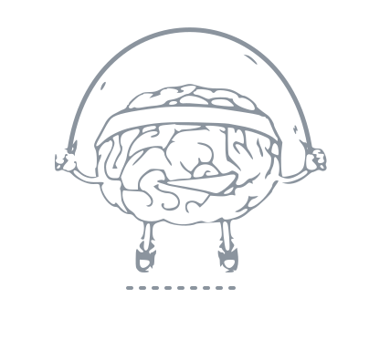

# Hey, I'm Mallikarjuna 👋

 

## 🗺️ Side Quest Log

| Quest | Status | The point |
|:--|:--:|:--|
| 🔨 [**Move**](https://github.com/Skmswamy/Move) — an iOS app, end to end | `🚧 building` | Just to see how far I can take an idea solo |
| 🧩 Untangling messy, knotted problems | `♾️ always` | Finding the one simple fix that quietly makes it all work |
| 🌱 New tools & tiny experiments | `🔁 weekly` | Whatever I'm curious about that week |
| ☕ Off the clock | `🌀 looping` | Chasing whatever new idea refuses to leave me alone |

 

## 🧰 Current loadout

 

---

By day I do product for consumer apps. If that's why you're here →
  
📍 <a href="https://mallikarjunaswamy.com">mallikarjunaswamy.com</a> &nbsp;·&nbsp;
💼 <a href="https://linkedin.com/in/mallikarjuna-swamy/">LinkedIn</a> &nbsp;·&nbsp;
✉️ <a href="mailto:skmswamy@gmail.com">skmswamy@gmail.com</a>

  
<i>The brain never stops skipping. Neither do the ideas.</i> 🧠

